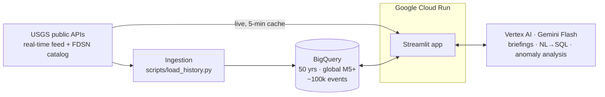

# 🌍 QuakeSense — AI Earthquake Situation Room for Communities

**Gen AI Academy APAC Hackathon** · Theme: AI for Better Living and Smarter Communities (Disaster Response & Recovery / Public Safety)

When an earthquake strikes, communities drown in raw numbers — magnitudes, depths, coordinates — while what people actually need is answers: *Was that dangerous? Who is affected? What should we do? Is this activity normal?* QuakeSense turns live and historical data from the **U.S. Geological Survey (USGS)** into plain-language decision intelligence for citizens, local officials, and journalists.

**100% real public data. Zero synthetic records.**

## What it does

| Tab | Capability | Powered by |
|---|---|---|
| 🗺️ Live Monitor | Global map + metrics of every M2.5+ quake in the past 7 days, refreshed every 5 min | USGS real-time GeoJSON feed |
| 📰 AI Briefings | One click turns raw seismic data (PAGER alert, depth, tsunami flag, felt reports) into a calm community briefing with recommended actions | Vertex AI Gemini |
| 💬 Ask the Data | Plain-English questions over 50 years of global M5+ earthquakes — Gemini writes the SQL, BigQuery executes it, Gemini explains the answer. Generated SQL is always shown (explainable AI) | Gemini + BigQuery |
| 📈 Anomaly Watch | Flags regions where this week's activity is ≥3× the 50-year baseline (swarms, aftershock sequences), with AI explanations | BigQuery baseline + Gemini |

## Architecture



Core requirements coverage: multiple data sources (real-time feed + historical catalog) ✅ · natural-language interaction with data ✅ · insights, recommendations, alerts ✅ · patterns & anomalies ✅ · AI-assisted decisions ✅ · scalable Google Cloud deployment ✅

## Quickstart

```bash
pip install -r requirements.txt
python scripts/load_history.py          # downloads USGS 1975→today, loads BigQuery (~5 min)
# or:  python scripts/load_history.py --local   (no GCP needed; NL2SQL tab disabled)
streamlit run app.py
```

Auth: `set GOOGLE_APPLICATION_CREDENTIALS=path\to\key.json` (service account needs BigQuery Data Editor, BigQuery Job User, Vertex AI User).

## Deploy to Cloud Run

```bash
gcloud run deploy quakesense --source . --region us-central1 \
  --allow-unauthenticated --memory 1Gi --set-env-vars GCP_PROJECT=usar-decision-intel
```

## Responsible AI

Every NL→SQL query passes a SELECT-only guardrail and the generated SQL is displayed to the user. Briefings are grounded strictly in USGS data with explicit caveats. The app states clearly: earthquakes cannot be predicted — QuakeSense supports awareness and preparedness decisions, not prediction. All AI features degrade gracefully to deterministic fallbacks.

## Data sources

U.S. Geological Survey Earthquake Hazards Program — real-time GeoJSON feeds and FDSN Event Web Service (public domain).

## Scaling path

Scheduled Cloud Function ingestion → streaming BigQuery inserts · multilingual briefings (Burmese, Thai...) · SMS/LINE alert delivery · Looker Studio public dashboards · PAGER + population-exposure joins for impact forecasting.
